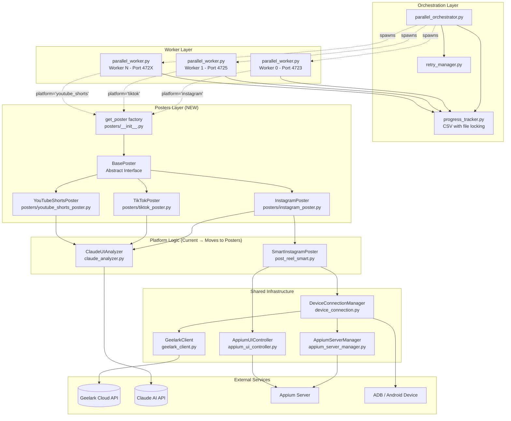

# Prompt 1 Response – Geelark Poster Architecture Diagram

## Current Architecture Overview

The system uses process-based parallelism with file-locked job coordination. Each worker is an independent OS process that claims jobs from a shared CSV file.

## Architecture Diagram (Mermaid)



## Layered Architecture (ASCII)

```
┌─────────────────────────────────────────────────────────────────────────────┐
│                         ORCHESTRATION LAYER                                 │
│  ┌─────────────────────┐  ┌─────────────────┐  ┌─────────────────────────┐ │
│  │ parallel_orchestrator│  │ retry_manager   │  │ progress_tracker        │ │
│  │ - spawns workers    │  │ - multi-pass    │  │ - CSV job queue         │ │
│  │ - manages shutdown  │  │ - error classify│  │ - file locking          │ │
│  └─────────────────────┘  └─────────────────┘  └─────────────────────────┘ │
└─────────────────────────────────────────────────────────────────────────────┘
                                    │
                                    ▼
┌─────────────────────────────────────────────────────────────────────────────┐
│                            WORKER LAYER                                     │
│  ┌──────────────────┐  ┌──────────────────┐  ┌──────────────────┐          │
│  │ parallel_worker  │  │ parallel_worker  │  │ parallel_worker  │          │
│  │ Worker 0         │  │ Worker 1         │  │ Worker N         │          │
│  │ Port 4723        │  │ Port 4725        │  │ Port 472X        │          │
│  └────────┬─────────┘  └────────┬─────────┘  └────────┬─────────┘          │
└───────────┼──────────────────────┼──────────────────────┼───────────────────┘
            │                      │                      │
            ▼                      ▼                      ▼
┌─────────────────────────────────────────────────────────────────────────────┐
│                         POSTERS LAYER (NEW)                                 │
│                                                                             │
│  ┌─────────────────────────────────────────────────────────────────────┐   │
│  │                    posters/__init__.py                              │   │
│  │  def get_poster(platform: str, phone_name: str, **kwargs) -> Poster │   │
│  │      if platform == "instagram": return InstagramPoster(...)        │   │
│  │      if platform == "tiktok": return TikTokPoster(...)              │   │
│  │      if platform == "youtube_shorts": return YouTubeShortsPoster()  │   │
│  └─────────────────────────────────────────────────────────────────────┘   │
│                                    │                                        │
│           ┌────────────────────────┼────────────────────────┐              │
│           ▼                        ▼                        ▼              │
│  ┌─────────────────┐    ┌─────────────────┐    ┌─────────────────────┐    │
│  │  BasePoster     │    │                 │    │                     │    │
│  │  (ABC)          │    │                 │    │                     │    │
│  │  - connect()    │    │                 │    │                     │    │
│  │  - post()       │    │                 │    │                     │    │
│  │  - cleanup()    │    │                 │    │                     │    │
│  └────────┬────────┘    │                 │    │                     │    │
│           │             │                 │    │                     │    │
│  ┌────────┴────────┐    │                 │    │                     │    │
│  ▼                 ▼    ▼                 │    ▼                     │    │
│  ┌─────────────┐ ┌─────────────┐ ┌─────────────┐ ┌─────────────────┐ │    │
│  │ Instagram   │ │ TikTok      │ │ YouTube     │ │ Future          │ │    │
│  │ Poster      │ │ Poster      │ │ Shorts      │ │ Platform        │ │    │
│  │             │ │             │ │ Poster      │ │ Poster          │ │    │
│  │ Claude      │ │ Claude      │ │             │ │                 │ │    │
│  │ prompts for │ │ prompts for │ │ Claude      │ │                 │ │    │
│  │ Instagram   │ │ TikTok      │ │ prompts for │ │                 │ │    │
│  │ UI flows    │ │ UI flows    │ │ YouTube     │ │                 │ │    │
│  │ error maps  │ │ error maps  │ │             │ │                 │ │    │
│  └─────────────┘ └─────────────┘ └─────────────┘ └─────────────────┘ │    │
│                                                                             │
└─────────────────────────────────────────────────────────────────────────────┘
                                    │
                                    ▼
┌─────────────────────────────────────────────────────────────────────────────┐
│                      SHARED INFRASTRUCTURE LAYER                            │
│                                                                             │
│  ┌─────────────────────┐  ┌─────────────────────┐  ┌───────────────────┐   │
│  │ DeviceConnection    │  │ AppiumUIController  │  │ GeelarkClient     │   │
│  │ Manager             │  │                     │  │                   │   │
│  │ - find_phone()      │  │ - tap()             │  │ - list_phones()   │   │
│  │ - connect_adb()     │  │ - swipe()           │  │ - start_phone()   │   │
│  │ - connect_appium()  │  │ - type_text()       │  │ - stop_phone()    │   │
│  │ - reconnect()       │  │ - dump_ui()         │  │ - upload_file()   │   │
│  └─────────────────────┘  └─────────────────────┘  └───────────────────┘   │
│                                                                             │
│  ┌─────────────────────┐  ┌─────────────────────────────────────────────┐  │
│  │ AppiumServerManager │  │ ClaudeUIAnalyzer (shared base, per-platform │  │
│  │ - start()           │  │ prompts injected by poster)                 │  │
│  │ - stop()            │  │                                             │  │
│  │ - is_healthy()      │  │                                             │  │
│  └─────────────────────┘  └─────────────────────────────────────────────┘  │
│                                                                             │
└─────────────────────────────────────────────────────────────────────────────┘
                                    │
                                    ▼
┌─────────────────────────────────────────────────────────────────────────────┐
│                         EXTERNAL SERVICES                                   │
│  ┌───────────────┐  ┌───────────────┐  ┌───────────────┐  ┌─────────────┐  │
│  │ Geelark Cloud │  │ Claude AI     │  │ Appium Server │  │ ADB/Device  │  │
│  │ API           │  │ API           │  │ (local)       │  │ (local)     │  │
│  └───────────────┘  └───────────────┘  └───────────────┘  └─────────────┘  │
└─────────────────────────────────────────────────────────────────────────────┘
```

## File Structure After Refactoring

```
geelark-automation/
├── parallel_orchestrator.py      # No changes needed
├── parallel_worker.py            # CHANGE: Import factory, call get_poster()
├── progress_tracker.py           # No changes needed
├── retry_manager.py              # No changes needed
├── config.py                     # No changes needed
├── parallel_config.py            # No changes needed
│
├── posters/                      # NEW DIRECTORY
│   ├── __init__.py               # Factory: get_poster(platform, phone_name, **kwargs)
│   ├── base_poster.py            # BasePoster ABC + PostResult dataclass
│   ├── instagram_poster.py       # InstagramPoster (wraps SmartInstagramPoster)
│   ├── tiktok_poster.py          # TikTokPoster (new implementation)
│   └── youtube_shorts_poster.py  # Future: YouTubeShortsPoster
│
├── post_reel_smart.py            # KEEP: SmartInstagramPoster (Instagram-specific logic)
├── claude_analyzer.py            # KEEP: Shared, but prompts come from posters
├── device_connection.py          # No changes needed
├── appium_ui_controller.py       # No changes needed
├── appium_server_manager.py      # No changes needed
├── geelark_client.py             # No changes needed
│
└── campaigns/
    ├── viral/
    │   ├── campaign.json         # ADD: "platform": "instagram"
    │   └── ...
    ├── podcast/
    │   ├── campaign.json         # ADD: "platform": "instagram"
    │   └── ...
    └── tiktok_promo/             # NEW CAMPAIGN
        ├── campaign.json         # "platform": "tiktok"
        ├── accounts.txt
        ├── captions.csv
        └── videos/
```

## Key Interfaces

### BasePoster (Abstract Base Class)

```python
from abc import ABC, abstractmethod
from dataclasses import dataclass
from typing import Optional

@dataclass
class PostResult:
    success: bool
    error: Optional[str] = None
    error_type: Optional[str] = None       # e.g., 'suspended', 'adb_timeout'
    error_category: Optional[str] = None   # 'account', 'infrastructure', 'unknown'
    retryable: bool = True
    platform: str = ""
    account: str = ""
    duration_seconds: float = 0.0

class BasePoster(ABC):
    @abstractmethod
    def connect(self) -> bool:
        """Establish connection to device. Returns True on success."""
        pass

    @abstractmethod
    def post(self, video_path: str, caption: str) -> PostResult:
        """Execute the posting flow. Returns PostResult."""
        pass

    @abstractmethod
    def cleanup(self):
        """Release resources and disconnect."""
        pass
```

### Factory Function

```python
# posters/__init__.py
from .base_poster import BasePoster, PostResult
from .instagram_poster import InstagramPoster

def get_poster(platform: str, phone_name: str, **kwargs) -> BasePoster:
    """Factory function to get platform-specific poster."""
    if platform == "instagram":
        return InstagramPoster(phone_name, **kwargs)
    elif platform == "tiktok":
        from .tiktok_poster import TikTokPoster
        return TikTokPoster(phone_name, **kwargs)
    elif platform == "youtube_shorts":
        from .youtube_shorts_poster import YouTubeShortsPoster
        return YouTubeShortsPoster(phone_name, **kwargs)
    else:
        raise ValueError(f"Unknown platform: {platform}")
```

### Worker Integration Point

```python
# parallel_worker.py - SINGLE CHANGE LOCATION
from posters import get_poster

def execute_posting_job(job, worker_config, progress_tracker):
    platform = job.get('platform', 'instagram')  # Default for backwards compat
    poster = get_poster(
        platform=platform,
        phone_name=job['account'],
        appium_url=worker_config.appium_url,
        system_port_range=worker_config.system_port_range,
    )

    try:
        if not poster.connect():
            return PostResult(success=False, error="Connection failed", ...)

        result = poster.post(job['video_path'], job['caption'])
        return result
    finally:
        poster.cleanup()
```

## Summary

The architecture cleanly separates:

1. **Orchestration Layer** - Unchanged. Manages workers, retries, job queue.
2. **Worker Layer** - Minimal change. Calls factory instead of SmartInstagramPoster.
3. **Posters Layer** - NEW. Platform-specific logic behind common interface.
4. **Infrastructure Layer** - Unchanged. Shared device/Appium/Claude code.

To add a new platform:
1. Create `posters/new_platform_poster.py` implementing `BasePoster`
2. Add one line to factory mapping in `posters/__init__.py`
3. Create campaign with `"platform": "new_platform"`

No changes to orchestrator, workers, or infrastructure code.
