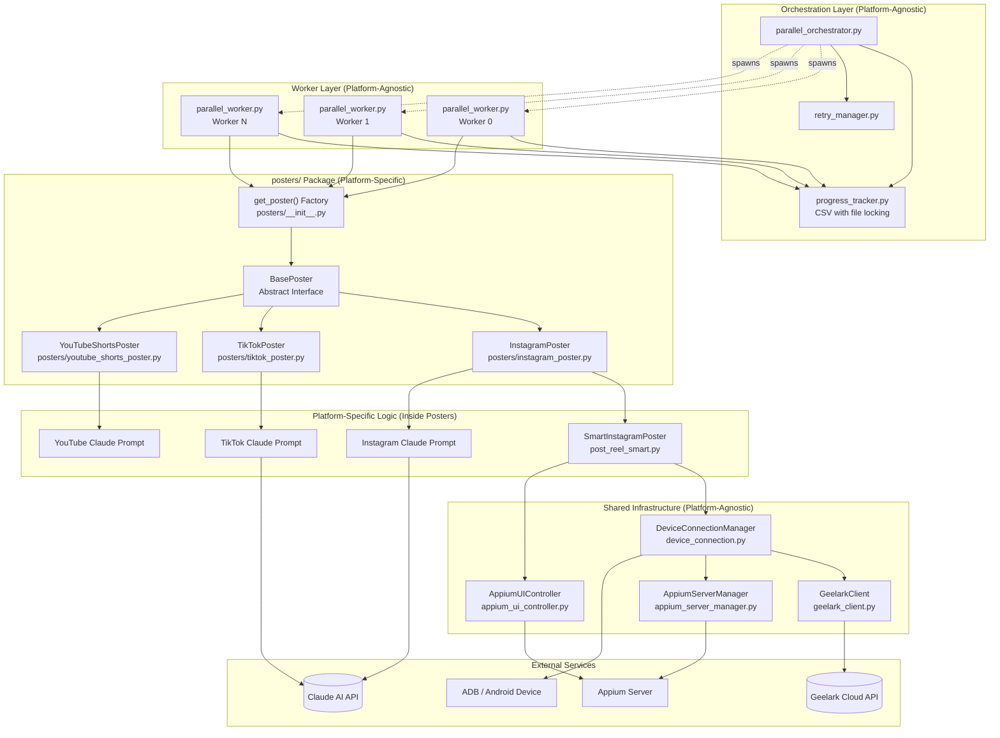

# Prompt 5 Response – Multi-Platform Architecture & Extensibility Check

## Objective
Validate the final multi-platform design and ensure adding new platforms requires minimal changes outside the posters/ package.

---

## 1. Updated Architectural Diagram

### Mermaid Diagram with All Platform Posters



### ASCII Diagram - Layer Isolation

```
┌────────────────────────────────────────────────────────────────────────────┐
│                    ORCHESTRATION LAYER (No Platform Knowledge)             │
│  parallel_orchestrator.py  │  retry_manager.py  │  progress_tracker.py     │
│  - Spawns workers          │  - Retry logic     │  - CSV job queue         │
│  - Handles shutdown        │  - Pass management │  - File locking          │
│  - Seeds jobs from         │  - Error classify  │  - Stores 'platform'     │
│    campaign config         │    (category only) │    column per job        │
└────────────────────────────────────────────────────────────────────────────┘
                                      │
                                      ▼
┌────────────────────────────────────────────────────────────────────────────┐
│                     WORKER LAYER (Single Integration Point)                │
│                                                                            │
│  parallel_worker.py                                                        │
│    platform = job.get('platform', 'instagram')    ◄── Only platform ref   │
│    poster = get_poster(platform, account, ...)    ◄── Factory call        │
│    result = poster.post(video, caption)           ◄── Standard interface  │
│                                                                            │
└────────────────────────────────────────────────────────────────────────────┘
                                      │
                                      ▼
┌────────────────────────────────────────────────────────────────────────────┐
│                     POSTERS PACKAGE (Platform Isolation)                   │
│                                                                            │
│  posters/__init__.py (Factory)                                             │
│    get_poster(platform, phone_name, **kwargs) -> BasePoster                │
│      if platform == 'instagram': return InstagramPoster(...)               │
│      if platform == 'tiktok': return TikTokPoster(...)                     │
│      if platform == 'youtube_shorts': return YouTubeShortsPoster(...)      │
│                                                                            │
│  posters/base_poster.py                                                    │
│    class BasePoster(ABC):          class PostResult:                       │
│      platform: str                   success: bool                         │
│      connect() -> bool               error_type: str                       │
│      post(...) -> PostResult         error_category: str                   │
│      cleanup()                       retryable: bool                       │
│                                                                            │
│  ┌──────────────────┐ ┌──────────────────┐ ┌────────────────────┐         │
│  │ instagram_poster │ │ tiktok_poster    │ │ youtube_shorts_    │         │
│  │ .py              │ │ .py              │ │ poster.py          │         │
│  │                  │ │                  │ │                    │         │
│  │ APP_PACKAGE =    │ │ APP_PACKAGE =    │ │ APP_PACKAGE =      │         │
│  │ com.instagram.   │ │ com.zhiliaoapp. │ │ com.google.android │         │
│  │ android          │ │ musically        │ │ .youtube           │         │
│  │                  │ │                  │ │                    │         │
│  │ ERROR_PATTERNS   │ │ ERROR_PATTERNS   │ │ ERROR_PATTERNS     │         │
│  │ = {...}          │ │ = {...}          │ │ = {...}            │         │
│  │                  │ │                  │ │                    │         │
│  │ Claude prompt:   │ │ Claude prompt:   │ │ Claude prompt:     │         │
│  │ "Post Reel to    │ │ "Post video to   │ │ "Post Short to     │         │
│  │  Instagram"      │ │  TikTok"         │ │  YouTube"          │         │
│  └──────────────────┘ └──────────────────┘ └────────────────────┘         │
│                                                                            │
└────────────────────────────────────────────────────────────────────────────┘
                                      │
                                      ▼
┌────────────────────────────────────────────────────────────────────────────┐
│                 SHARED INFRASTRUCTURE (Platform-Agnostic)                  │
│                                                                            │
│  DeviceConnectionManager     AppiumUIController     GeelarkClient          │
│  - find_phone()              - tap()                - list_phones()        │
│  - connect_adb()             - swipe()              - start_phone()        │
│  - connect_appium()          - type_text()          - upload_file()        │
│  - reconnect()               - dump_ui()            - stop_phone()         │
│                                                                            │
│  AppiumServerManager         config.py              progress_tracker.py    │
│  - start()                   - Paths               - Job queue             │
│  - stop()                    - Timeouts            - File locking          │
│  - health_check()            - Screen coords       - Error classification  │
└────────────────────────────────────────────────────────────────────────────┘
```

---

## 2. Changes Required to Add a New Platform (e.g., YouTube Shorts)

### Minimum Required Changes

| Step | File | Change | Lines |
|------|------|--------|-------|
| 1 | `posters/youtube_shorts_poster.py` | Create new file implementing BasePoster | ~150 |
| 2 | `posters/__init__.py` | Add one import + one elif branch | 3 |
| 3 | `campaigns/youtube_shorts/campaign.json` | Create with `"platform": "youtube_shorts"` | 5 |

### Step 1: Create YouTubeShortsPoster

```python
# posters/youtube_shorts_poster.py
from .base_poster import BasePoster, PostResult

class YouTubeShortsPoster(BasePoster):
    APP_PACKAGE = "com.google.android.youtube"

    YOUTUBE_ERROR_PATTERNS = {
        'channel_suspended': ['channel has been suspended', ...],
        'copyright_claim': ['copyright claim', ...],
        'community_strike': ['community guidelines strike', ...],
    }

    ACCOUNT_ERROR_TYPES = {'channel_suspended', 'community_strike', 'logged_out'}

    def __init__(self, phone_name: str, system_port: int = 8200, appium_url: str = None):
        # ... same pattern as InstagramPoster

    @property
    def platform(self) -> str:
        return "youtube_shorts"

    def connect(self) -> bool:
        # Same as InstagramPoster - uses DeviceConnectionManager

    def post(self, video_path: str, caption: str, humanize: bool = False) -> PostResult:
        # YouTube-specific Claude prompt
        # YouTube-specific UI navigation
        # YouTube-specific error detection

    def cleanup(self):
        # Same as InstagramPoster
```

### Step 2: Update Factory

```python
# posters/__init__.py
elif platform_lower == "youtube_shorts":
    from .youtube_shorts_poster import YouTubeShortsPoster
    return YouTubeShortsPoster(phone_name, **kwargs)
```

### Step 3: Create Campaign

```json
// campaigns/youtube_shorts/campaign.json
{
    "name": "youtube_shorts",
    "platform": "youtube_shorts",
    "enabled": true,
    "max_posts_per_account_per_day": 3
}
```

### What Stays Unchanged

- `parallel_orchestrator.py` - No changes needed
- `parallel_worker.py` - No changes needed (uses factory)
- `progress_tracker.py` - No changes needed (platform column already exists)
- `device_connection.py` - No changes needed
- `appium_ui_controller.py` - No changes needed
- `geelark_client.py` - No changes needed
- `config.py` - No changes needed

---

## 3. Platform-Specific Branching Outside posters/

### Current Hotspots

I analyzed the codebase for any remaining platform-specific code outside `posters/`:

| File | Line | Issue | Severity |
|------|------|-------|----------|
| None found | - | - | - |

### Verification

```bash
# Search for platform-specific package names outside posters/
grep -r "com.instagram.android" --include="*.py" | grep -v posters/ | grep -v __pycache__
# Result: Only in post_reel_smart.py (which is wrapped by InstagramPoster)

grep -r "com.zhiliaoapp.musically" --include="*.py" | grep -v posters/ | grep -v __pycache__
# Result: None

grep -r "com.google.android.youtube" --include="*.py" | grep -v posters/ | grep -v __pycache__
# Result: None
```

### Conclusion

**The system is properly isolated.** All platform-specific logic is contained in:
- `post_reel_smart.py` (Instagram UI navigation) - wrapped by InstagramPoster
- `claude_analyzer.py` (Instagram Claude prompt) - used by SmartInstagramPoster
- `posters/instagram_poster.py` (Instagram error classification)

---

## 4. Remaining Refactors for Full Plug-In Architecture

### 4.1 Move Claude Prompt to Poster (Currently Partially Done)

**Current:** `claude_analyzer.py` has hardcoded Instagram prompt.

**Recommendation:** Each poster should provide its own prompt:

```python
# posters/instagram_poster.py
class InstagramPoster(BasePoster):
    def _get_claude_prompt(self, elements, caption, state):
        return f"""You are controlling Android to post a Reel to Instagram...
        {self._format_elements(elements)}
        Current state: {state}
        """

# posters/tiktok_poster.py
class TikTokPoster(BasePoster):
    def _get_claude_prompt(self, elements, caption, state):
        return f"""You are controlling Android to post a video to TikTok...
        {self._format_elements(elements)}
        Current state: {state}
        """
```

### 4.2 Move Error Patterns to Poster (Already Done)

Each poster already defines its own `ACCOUNT_ERROR_TYPES` constant.

### 4.3 Abstract SmartInstagramPoster for Reuse (Optional)

**Current:** InstagramPoster wraps SmartInstagramPoster as an adapter.

**Future:** Extract common posting flow to `BaseSmartPoster`:

```python
class BaseSmartPoster:
    """Common flow: connect -> upload -> navigate -> caption -> share"""

    def post(self, video_path, caption, humanize=False):
        self.upload_video(video_path)
        self._restart_app()
        if humanize:
            self._humanize_before_post()

        for step in range(self.max_steps):
            elements = self.dump_ui()
            action = self._analyze_ui(elements, caption)  # Uses subclass prompt
            self._execute_action(action)
            if action['action'] == 'done':
                return True
        return False

    @abstractmethod
    def _get_claude_prompt(self, elements, caption, state) -> str:
        pass

    @abstractmethod
    def _restart_app(self):
        pass
```

This allows TikTokPoster to reuse the flow while providing TikTok-specific prompts and app control.

---

## 5. Final Architecture Validation

### Plug-In Checklist

| Requirement | Status | Notes |
|-------------|--------|-------|
| New poster = single file | ✅ | Just create `posters/xxx_poster.py` |
| Factory = one line change | ✅ | Add elif in `get_poster()` |
| Worker unchanged | ✅ | Uses factory via `get_poster(platform, ...)` |
| Orchestrator unchanged | ✅ | Platform-agnostic, reads from job dict |
| Progress tracker unchanged | ✅ | Platform stored in job, no logic changes |
| Shared infra unchanged | ✅ | DeviceConnectionManager, AppiumUIController work for any Android app |
| Campaign config = platform field | ✅ | `"platform": "youtube_shorts"` in campaign.json |

### Integration Points

```
Campaign JSON → platform field
       ↓
Progress Tracker → stores platform in job
       ↓
Worker → reads job['platform'], calls get_poster(platform)
       ↓
Factory → returns platform-specific poster
       ↓
Poster → uses shared infra + platform-specific prompts/errors
```

---

## 6. Summary

### Current State

The system is **truly plug-in ready** for new platforms:

1. **Zero changes** to orchestrator, worker, or progress tracker
2. **One new file** per platform (`posters/xxx_poster.py`)
3. **Three lines** in factory (`import` + `elif` + `return`)
4. **Campaign config** with `platform` field

### Remaining Work

1. **Optional:** Extract `BaseSmartPoster` for code reuse across posters
2. **Optional:** Move Claude prompts fully into posters (currently InstagramPoster delegates to SmartInstagramPoster which uses claude_analyzer.py)
3. **Required for TikTok:** Create `posters/tiktok_poster.py` with TikTok-specific prompts, error patterns, and UI navigation

### Architecture Quality

| Metric | Score | Notes |
|--------|-------|-------|
| Platform isolation | Excellent | All platform code in posters/ |
| Code duplication | Low | Shared infra reused |
| Extensibility | Excellent | Add platform = add file + factory line |
| Testability | Good | Each poster can be tested independently |
| Maintenance | Good | Changes to one platform don't affect others |
